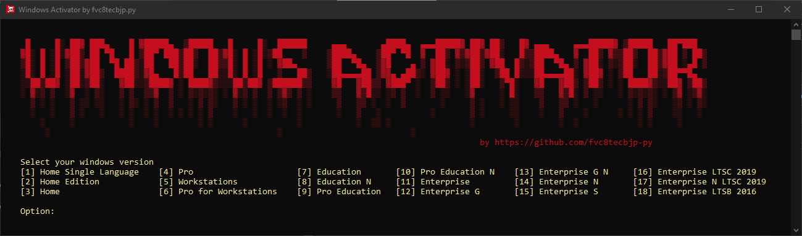

# Windows Activator 🔐

This project was made in Visual Studio 2022 17.6.5.
## Summary
- [Installation](Installation)
## Installation
1. Download the unique [release](https://github.com/fvc8tecbjp-py/windows-activator/releases/tag/stable) and unzip it.
2. Run <code>setup.exe</code>, it'll install the necessary framework (if not installed) and then install the program.
3. The program will run after the installation. Open the Task Manager and open the file location of the process.
4. Stop the program and reopen it with admin privileges. It **MUST** run with admin privileges.
## Usage
1. Enter the version of your Windows.
2. Choose one of the serial codes available.
3. Wait for the done message.
4. Test if it worked, one way is by trying to change the desktop's wallpaper.
5. Choose another serial code (if available) until it works.
## Window Versions Available
- Windows 10 Home Single Language
- Windows 10 Home Edition
- Windows 10 Home
- Windows 10 Pro
- Windows 10 Workstations
- Windows 10 Pro for Workstations
- Windows 10 Education
- Windows 10 Education N
- Windows 10 Pro Education
- Windows 10 Pro Education N
- Windows 10 Enterprise
- Windows 10 Enterprise G
- Windows 10 Enterprise G N
- Windows 10 Enterprise N
- Windows 10 Enterprise S
- Windows 10 Enterprise LTSC 2019
- Windows 10 Enterprise N LTSC 2019
- Windows 10 Enterprise LTSB 2016
